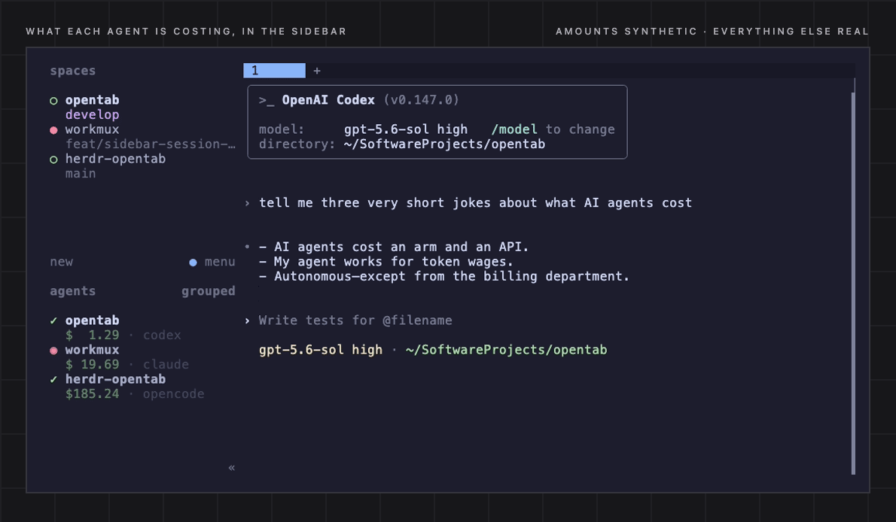

# herdr-opentab

See what your agents are costing you and how long they've been working or
waiting, right in the [Herdr](https://herdr.dev) sidebar.



<sub>A real Claude Code session in the pane, its price in the sidebar. The
amounts come from `opentab cost --demo`, so nobody's actual spend is on
display.</sub>

Each agent row gains the total spend of the session running in that pane,
subagents included. The numbers come from
[OpenTab](https://github.com/hamidi-dev/opentab), which reads the transcripts
your agent already writes — Claude Code, Codex, OpenCode, pi, OMP, Hermes,
OpenClaw, Zaly. No API keys, no telemetry, nothing extra logged.

## Install

Needs Herdr 0.7+ and Python 3.9+. If you do not have OpenTab yet:

```bash
pipx install opentab-ai        # or: brew install hamidi-dev/tap/opentab
```

Then:

```bash
herdr plugin install hamidi-dev/herdr-opentab
herdr plugin action invoke opentab.setup     # put $cost and $elapsed in the sidebar
herdr server reload-config                  # apply the sidebar layout
herdr plugin action invoke opentab.refresh   # price everything now
```

`refresh` prints how many agents it priced. Start an agent and its price shows
up beside it within a few seconds; after that it keeps itself up to date, and
from your next Herdr session it starts on its own.

Already tuned your own `[ui.sidebar.agents]` rows? `setup` leaves them alone and
prints the one line to paste. Put `"$cost"` first in its row — herdr fills a row
left to right, so a price that follows the agent label starts wherever that
label happens to end, and the amounts zig-zag down the sidebar. Leading its row,
every price starts in the same column, and the daemon pads them to a common
width so the digits line up too:

```toml
rows = [
  ["state_icon", "workspace", "tab"],
  [{ token = "$cost", fg = "#a6e3a1" }, "$elapsed", "agent"],
]
```

## Working / idle timer

`$elapsed` shows time in the agent's current state: `02:18` means two minutes,
18 seconds working, idle or blocked, as indicated by Herdr's state icon. After
an hour it becomes `1:02:18`. It resets on a state or session change, not on a
cost update. Herdr's "done" means unseen idle output; viewing it does not reset
the timer.

- Updates roughly every second, without extra OpenTab pricing calls or API requests.
- `~` means observation began mid-state: plugin startup/restart, a session switch,
  or a gap in tracking. After an observed state change the marker disappears.
- Herdr supplies no transition timestamp, so even an observed transition is
  accurate only to the polling interval. Missed cycles detected through its
  state sequence restart with `~`; unknown states show no timer.
- Timers are per pane, independent of transcript availability or project-price
  ambiguity. Official integrations let the timer detect session switches within
  the same terminal; without a session ID, it can only follow the terminal/state.
- A stopped or unreachable timer expires from the sidebar within five seconds
  of its last report. Set `"elapsed": false` to disable it.

This is **not session age, accumulated working time, or a cache-expiry countdown**.
CacheBell is separate and is neither required nor changed by this plugin.

Upgrading an existing install: add `"$elapsed"` to your sidebar rows, run
`herdr server reload-config`, then restart the daemon with `opentab.stop` followed
by `opentab.refresh`. `setup` never rewrites your existing layout. A running
sidebar may keep its old layout until the explicit reload, even while the timer
is already being published.

## Which session a pane shows

Two panes in the same repo will show the same number until Herdr can tell their
sessions apart — and it learns a session id only from an official integration:

```bash
herdr integration install claude     # or codex, opencode, …
```

With one installed, a pane is priced by **its own session id**: exactly that
pane, nothing else. Without one, it falls back to the pane's **directory**, and
OpenTab prices that project's most recently active session — right for one agent
per project.

When two agents *do* share a project, that one number cannot say which of them
spent it, so neither gets it: both panes stay blank until Herdr can tell their
sessions apart. Same repo counts even from different subdirectories or a
worktree — OpenTab prices a directory as its whole project, so that is how the
panes are grouped. `opentab.doctor` says so explicitly, and `"fallback": "off"`
turns the directory guess off altogether.

## Nothing shows up?

```bash
herdr plugin action invoke opentab.doctor
```

It walks the chain — opentab, herdr, the daemon, your sidebar config, then every
agent with the target it was priced by — and marks where it breaks. The usual
suspects:

- **`$cost` is not in your sidebar rows.** Herdr draws only the tokens the
  layout asks for. Run `opentab.setup`.
- **`opentab` is not on the Herdr server's `PATH`.** Point `opentab_bin` at the
  full path.
- **No backend claims that session.** Check by hand:
  `opentab cost <session-id-or-directory>`. Empty means no transcript was found
  for it; `opentab doctor` lists which backends it can see. (Copilot and VS Code
  record no live session, so those panes never price.)
- **A price that never changes.** When a backend read fails, the whole table is
  dropped and the last good numbers stay put rather than blanking your sidebar.
  `doctor` prints the tail of the log that recorded it.
- **The prices went away.** Each one carries a lease the daemon keeps renewing,
  so if it stops the numbers clear instead of sitting there looking current.
  `doctor` says whether it is running; `opentab.refresh` starts it again.

## Actions

| | |
| --- | --- |
| `opentab.refresh` | price everything now, and start the daemon if it is not running |
| `opentab.setup` | add `$cost` and `$elapsed` to the sidebar rows |
| `opentab.doctor` | the walk-through above |
| `opentab.stop` | stop the daemon until the next Herdr start |

Herdr plugins cannot ship keybindings, so bind one yourself in `config.toml`:

```toml
[[keys.command]]
key = "prefix+$"
type = "plugin_action"
command = "opentab.refresh"
```

## Settings

Everything below has a working default. To change one, create
`$(herdr plugin config-dir opentab)/config.json` with just the keys you care
about — the daemon rereads it every round, no restart:

```json
{ "interval_secs": 5, "strip_approx": true }
```

| key | default | |
| --- | --- | --- |
| `token` | `cost` | sidebar token name; rename it to live beside another cost plugin |
| `elapsed` | `true` | publish the `$elapsed` state-duration timer; disabled automatically if `token` is already `elapsed` |
| `interval_secs` | `10` | seconds between rounds while an agent is working (min 3) |
| `idle_interval_secs` | `60` | …and when none is |
| `fallback` | `project` | `off` prices only panes with a real session id |
| `agents` | all | limit to certain agents, e.g. `["claude", "codex"]` |
| `opentab_bin` | `opentab` | full path, when it is not on `PATH` |
| `opentab_args` | none | extra flags for `opentab cost`, e.g. `["--harness", "claude"]` |
| `ttl_ms` | 3 idle rounds | how long a price stays valid; the daemon renews it, so a stopped daemon takes its prices down with it. `0` keeps the last number forever |
| `strip_approx` | `false` | drop OpenTab's leading `~`, which marks an estimate |
| `align` | `true` | pad prices to a common width; set `false` if `$cost` ends its row |

## Development

```bash
herdr plugin link .          # use this working tree
python3 run_tests.py -v      # stdlib unittest, no server needed
HERDR_OPENTAB_FOREGROUND=1 HERDR_OPENTAB_ONCE=1 python3 src/daemon.py --run
```

One daemon prices every pane in a single `opentab cost --batch -` call and
writes back only the panes whose number changed, so ten agents still cost one
opentab process per round. `src/core.py` holds those decisions and does no I/O,
which is where the interesting cases are tested.

`src/elapsed.py` observes Herdr on a separate worker thread in that same daemon,
so even a slow or failed pricing batch cannot freeze its ticks. It uses its own
metadata source and a fixed five-second lease, independent of price
lease settings. No new dependencies or changes to OpenTab are needed.

## License

MIT
